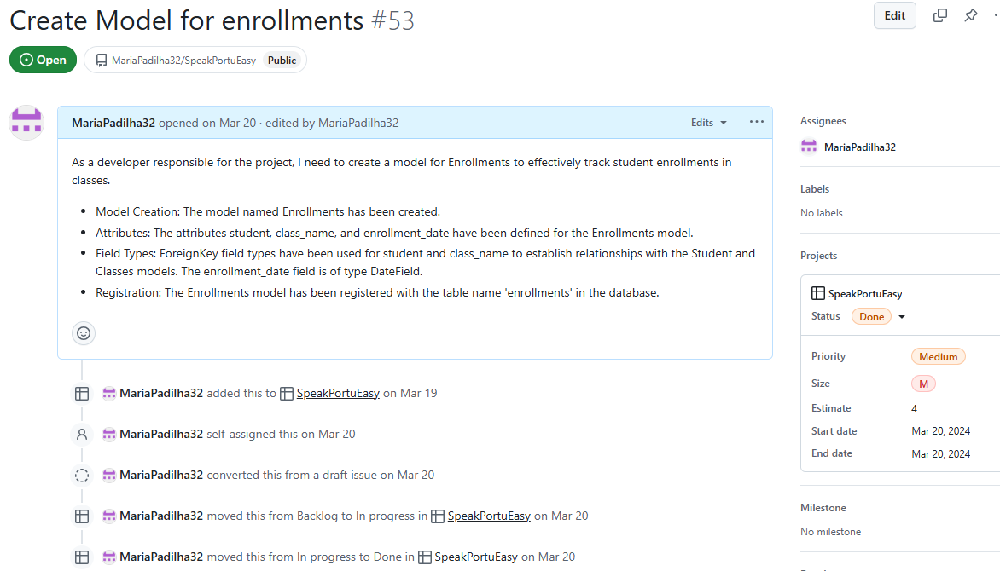
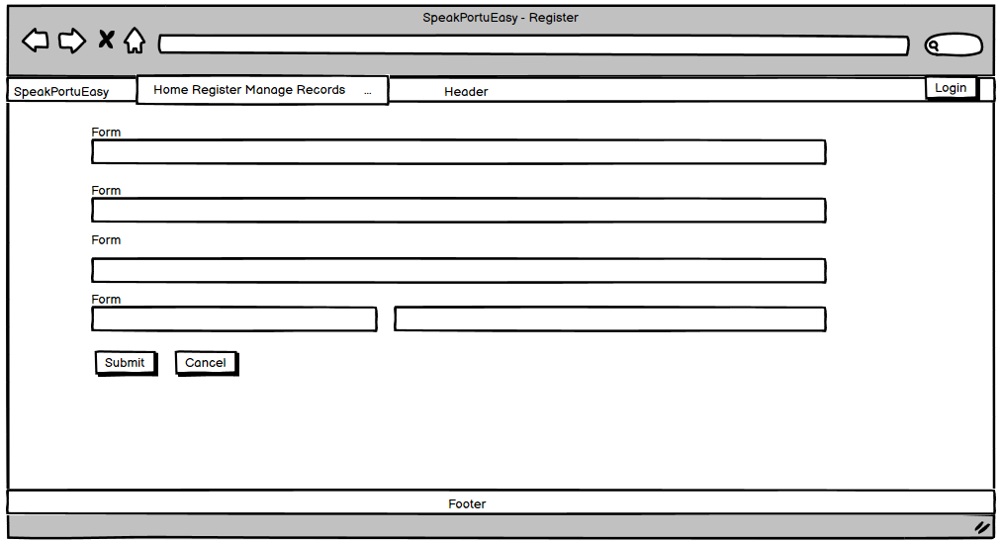
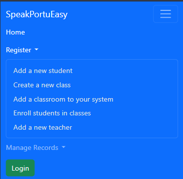
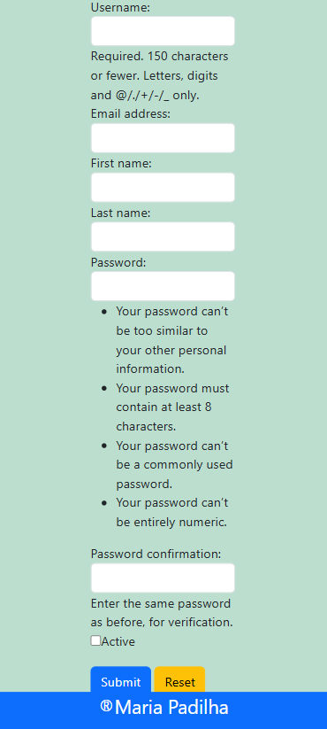
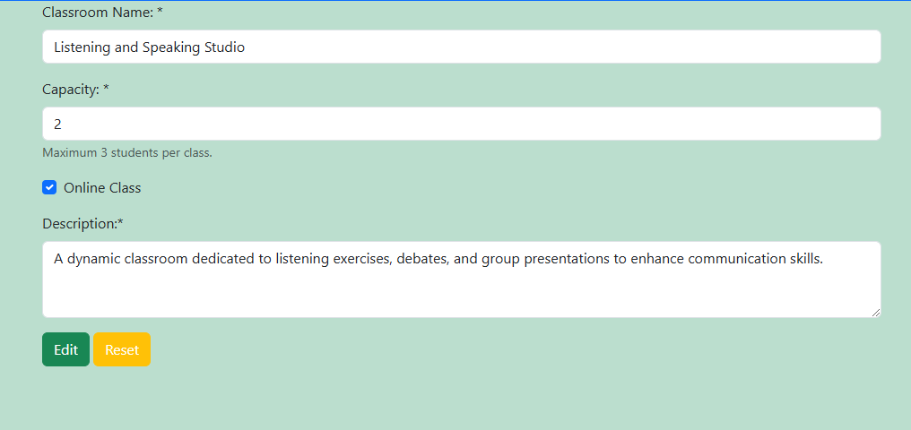
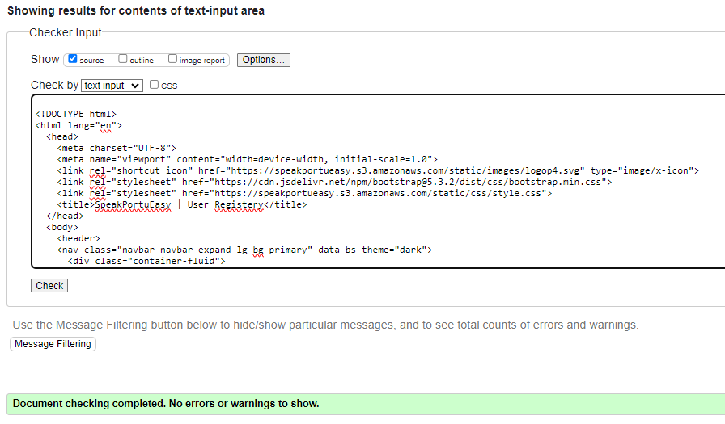

# SpeakPortuEasy


## Introduction:

Welcome to SpeakPortuEasy!
SpeakPortuEasy is a versatile system designed for schools to efficiently manage class, classroom, and student information. It caters to administrators and teachers, providing them with a streamlined platform to organize and oversee their educational resources. This allows teachers to easily edit or delete records as necessary. The primary goal of SpeakPortuEasy is to simplify the process of finding information about enrollments, classes, students, and more, making classroom management straightforward and hassle-free. The technologies used for this project are HTML, CSS, JavaScript, Python, Django and Heroku Postgres as a relational database.
You can access the live application at this link: 

[Live Site - SpeakPortuEay](https://speakportueasypp4-342d78e3516e.herokuapp.com/home/)

[Repository](https://github.com/MariaPadilha32/SpeakPortuEasy)

__Developed by Maria Fernanda Dias Padilha__

## Table of Contents
- [SpeakPortuEasy](#speakportueasy) *UPDATE*
  - [Table of Contents](#table-of-contents)

- [User-Experience-Design](#user-experience-design) *UPDATE*
  - [The-Strategy-Plane](#the-strategy-plane)
    - [Site-Goals](#site-goals) *UPDATE*
    - [Agile Planning](#agile-planning) *UPDATE*
      - [User Stories](#user-stories)
	- [Wireframes](#wireframes) *NEW*
  - [The-Structure-Plane](#the-structure-plane)
    - [Features](#features)
    - [Features Left To Implement](#features-left-to-implement)
  - [The-Skeleton-Plane](#the-skeleton-plane)
    - [Database-Design](#database-design)
    - [Security](#security)
  - [The-Surface-Plane](#the-surface-plane)
    - [Design](#design)
    - [Colour-Scheme](#colour-scheme) *UPDATE*
    - [Typography](#typography)
    - [Imagery](#imagery)
  - [Technolgies](#technolgies)
  - [Testing](#testing)
  - [Deployment](#deployment)
    - [Version Control](#version-control)
    - [Heroku Deployment](#heroku-deployment)
    - [Run Locally](#run-locally)
    - [Fork Project](#fork-project)
  - [Credits](#credits)
  - [Acknowledgements](#acknowledgements)

# User-Experience-Design

## Target Audience

**School Administrators**

- Role: Oversee the system to ensure efficient management of student, teacher, class, classroom, and enrollment data.
- Needs: Comprehensive tools to view, edit, delete, and analyze data related to school operations.
	- Expectations:
		- Secure access to all features.
		- Intuitive interface for managing records.
		- Role-based permissions to ensure data integrity.
		- Ability to monitor user activities and manage users.

**Teachers**

- Role: Manage their specific classes, students, and schedules.
- Needs: Tools to register, search, and update information about their own records.
	- Expectations:
		- Ability to create and manage their records (students, classes, etc.).
		- User-friendly interface for navigating, adding, and updating information.
		- Assurance of data security and privacy.

## User Requirements and Expectations

**User Requirements**

1. User-Friendly Interface

- Clean, intuitive design for easy navigation.
- Mobile responsiveness for access on various devices.

2. Role-Based Access Control

- Admins (Superusers): Full access to all features and records.
- Record Creators: Permissions to view, edit, and delete only their own records.
- Other Users: View-only access, requiring manual URL entry to view specific records.

3. CRUD Functionality

- Ability to Create, Read, Update, and Delete records for students, teachers, classes, classrooms, and enrollments.

4. Error Handling

- Informative error pages (404, 500) for user guidance during issues.

5. Search and Pagination

- Efficient search options for records.
- Pagination for managing large datasets.

6. Notes Management

- Options to add, edit, and delete notes related to students, classes, and other entities.

7. Secure Data Management

- Protection of sensitive user and school data.
- Clear feedback messages for all actions (e.g., confirmation, error).

**User Expectations**

1. Clarity and Accessibility

- Simple and clear instructions for all actions.
- Logical navigation flow for a seamless user experience.

2. Responsiveness

- Consistent performance across devices and browsers.

3. Flexibility and Scalability

- Capability to handle increasing numbers of records and users.
- Adaptable for future features or enhancements.

4. Transparency

- Clear information about permissions and access limits for different user roles.

5. Reliability

- System stability with minimal downtime or errors.
- Fast load times for pages and actions.

6. Support and Documentation

- Comprehensive documentation in the README for troubleshooting and system usage.

## The-Strategy-Plane *UPDATE*

The site is aimed at helping language teachers, specifically those teaching English or Portuguese. The user can enroll students, keep track of their classes, and perform create, read, update, and delete (CRUD) operations on student and class information as needed. This ensures that teachers can easily manage their classrooms and student records efficiently.

### Creater Goals

 - **Efficient Data Management:** Ensure smooth CRUD (Create, Read, Update, Delete) operations for managing classes, classrooms, and student information.
 - **User-Friendly Interface:** Design an intuitive and responsive UI for both administrators and teachers.
 - **Streamlined Navigation:** Provide easy navigation through well-organized menus and pages.
 - **Search and Filters:** Enable advanced search and filtering options for quick access to records.
 - **Documentation:** Provide comprehensive documentation, including a README file, to guide users and developers.

### Main User Stories

 - **As a user,** I want to register an account so I can access the system’s features.
 - **As a user,** I want to log in securely so that my data remains protected.
 - **As a user,** I want to easily view all available information so I can choose the one I need.
 - **As a user,** I want to search for specific students, classes, or enrollments to quickly access the required information.
 - **As a user,** I want to be able to filter results to narrow down my search.
 - **As a user,** I want to access a detailed view of a student's profile to review their information.
 - **As a user,** I want to receive notifications or messages about system updates or errors to stay informed.
 - **As a user,** I want the interface to be responsive so I can use it on my phone, tablet, or desktop.
 - **As a user,** I want to be notified when a new information is registered, edited, deleted or if something goes wrong.

## The-Scope-Plane

The initial plan for this project was more ambitious than the final result. Initially, I envisioned multiple options, templates, and functionalities, but as the project progressed, I realized that some of these features were not feasible within the available timeframe. Adjustments were made to focus on delivering a functional and successful product.

To achieve my goals, I adopted a phased approach to ensure the core features were implemented effectively, with room for improvement in later iterations.

### Initial Development
The project began with a focus on creating the foundational features:
- Home Page: Designed as the entry point, introducing the system's purpose.
- Registration Templates: Developed for managing students, teachers, classes, enrollments, and classrooms.
- Search Pages: Implemented to enable users to retrieve information efficiently.
- CRUD Functionality: Ensured users could create, edit, and delete records seamlessly.

### Iterative Refinements and Incorporating Feedback
After receiving feedback from reviewers, I worked to address the highlighted issues and polish the project:
- Enhanced UI and Navigation: Improved the interface for better usability and consistency.
- Testing and Adjustments: Conducted comprehensive testing to validate that the system met all required criteria.
- Bug Fixes: Resolved issues affecting the functionality and performance of the system.
- Improved README Documentation: Ensured it fully captured the project's scope, features, and usage instructions.

### Agile Planning

The development of this project followed Agile methodologies to maintain flexibility and ensure continuous improvement. While unforeseen family circumstances led to pauses in the project, the Agile framework helped me adapt and refocus when needed. This experience underscored the importance of iterative progress and responsive planning.

**Approach and Tools**

- [Kanban Board](https://github.com/users/MariaPadilha32/projects/6)

During the active development phases, I used a detailed Kanban board to manage each step of the project. The Kanban board was divided into three sections: Backlog, Pending, and Done. All user stories were meticulously detailed with expectations and acceptance criteria for each step.

The Kanban board, which can be viewed [here](https://github.com/users/MariaPadilha32/projects/6) shows the progress and detailed project cards. Each user story includes specific acceptance criteria to define the functionality required for completion.

**User Stories**
Each feature was broken down into user stories with clear expectations and acceptance criteria. Initially, these user stories served as rough guidelines, which were refined as the project progressed. This iterative process allowed for better alignment with project goals and user needs.

**Challanges and Learnings**

- Adapting to Unforeseen Events:
Pausing the project due to personal circumstances taught me the importance of flexibility. By reorganizing tasks on the Kanban board and prioritizing based on impact, I ensured that progress resumed smoothly without losing focus on critical features.

- First Experience with Agile:
As a solo developer, implementing Agile for the first time was a learning curve. While the iterative, collaborative nature of Agile felt unconventional to manage alone, it highlighted the value of incremental progress and self-reflection. The process helped me identify areas for improvement, particularly in planning and execution.

**Key Techniques Used**

- Moscow Prioritization:
I adopted the Moscow prioritization technique to classify requirements into Must-Have, Should-Have, Could-Have, and Won't-Have. This framework ensured that the most critical features were completed first, balancing scope with available time and resources.

- Time-Boxed Iterations:
I worked in time-boxed iterations focusing on prioritized tasks. This approach allowed me to deliver functional increments consistently, despite the challenges faced.

**Sample User Stories and Tasks**
User stories were instrumental in breaking down the project into actionable tasks. Each story was designed to reflect a specific user goal, providing a clear roadmap for development and testing.
Here are examples of user stories and development tasks completed during the project:

1. User Story 1:


2. User Story 4:


3. User Story 12:


4. User Story 29:


5. User Story 53:


6. User Story 274:


7. User Story 287:


**Reflection and Future Improvements**

While this project introduced me to Agile principles, I recognize that there is room for improvement. For example:

- Increasing the frequency of updates to the Kanban board would have made tracking progress more effective.
- Incorporating formal sprints with clearer objectives could have further streamlined development.

Despite these limitations, the experience has provided invaluable lessons, preparing me to adopt a more structured Agile approach in future projects.

### Initialization and Setup

1. Project Initialization
 - Initialize the project to set up the development environment.

2. Configuration Setup
 - Establish initial project configurations for scalability and maintainability.
 
3. Main App Creation
 - Develop the primary app to house core functionalities.

#### Template and UI Development

1. Base HTML Template Creation
 - Develop a reusable base template for consistent styling across all pages.

2. Index.html Creation
 - Design the landing page to introduce the system's purpose and guide users.
 
3. Template Integration and Inheritance
 - Implement inheritance to streamline page layouts and reduce code redundancy.

### View and URL Configuration

1. View Configuration
 - Configure views to render the correct templates.

2. URL Configuration
 - Configure URLs to route requests to appropriate views.

### User Authentication
Implemented secure access and user management:

1. Create Login Template and Implement Login Page
 - Develop the login page to authenticate users.

2. Authentication Features
 - Enable password reset and user role management.

### CRUD Functionalities for Different Models

1. Student Management
 - Develop forms and views for creating, reading, updating, and deleting (CRUD) student records.

2. Teacher Management
 - Implement CRUD functionalities for teachers, including registration, editing, and deletion.

3. Class Management
 - Implement CRUD functionalities for classes, including registration, editing, and deletion.

4. Enrollment Management
 - Implement CRUD functionalities for enrollments, including registration, editing, and deletion.

5. Classroom
 - Implement CRUD functionalities forclassroom, including registration, editing, and deletion.

#### Error Handling and Notifications

1. Error Pages
 - Create error pages for 404 and 500 errors to inform users of issues.

2. User Notifications
 - Implement feedback mechanisms for users during CRUD operations to ensure they are informed of successful actions.

#### Static Files and Navigation

1. Static Files Configuration
 - Configure static files to serve CSS and JavaScript correctly.

2. Navigation Links
 - Add navigation links to the nav bar for easy access to different parts of the site.

### Miscellaneous

1. Query Functions
 - Implement query functions for different models to allow users to search and find specific data.

2. Bug Fixes and Enhancements
 - Address and correct various bugs and enhance existing functionalities to improve user experience.

3. Database Configuration
 - Configure the database to store application data.

4. Documentation
 - Complete README and testing documentation to provide comprehensive information on the project.

### Wireframes

 - Wireframes were created to visualize the layout and structure of key pages in the system. These designs helped ensure that the site's functionality aligned with user stories and goals. Below are the wireframes for the most critical pages:

<details><summary>Big screens - laptop & desktop</summary>

<details><summary>Home page</summary>

</details>

<details><summary>Menu</summary>

</details>

<details><summary>Login</summary>

</details>

<details><summary>Registery</summary>

</details>

<details><summary>Search page</summary>

</details>

<details><summary>Edit Page</summary>

</details>

<details><summary>Delete Page</summary>

</details>
</details>

<details><summary>Medium screens - tablet</summary>

<details><summary>Home page/ Menu</summary>

</details>

<details><summary>Login</summary>

</details>

<details><summary>Registery</summary>

</details>

<details><summary>Search page</summary>

</details>

<details><summary>Edit Page</summary>

</details>

<details><summary>Delete Page</summary>

</details>
</details>

<details><summary>Small screens - mobile</summary>

<details><summary>Home Page/ Menu</summary>

</details>

<details><summary>Login</summary>

</details>

<details><summary>Registery</summary>

</details>

<details><summary>Search page</summary>

</details>

<details><summary>Edit Page</summary>

</details>

<details><summary>Delete Page</summary>

</details>
</details>

## The-Structure-Plane

## Design

### Colour-Scheme


- #bbdece (Light Cyan/Teal)

**Feelings:** Calm, refreshing, soothing.
Description: This color often evokes feelings of tranquility and peace, reminiscent of clear skies or calm waters. It can be very refreshing and is often used to create a sense of cleanliness and purity.

- #feedaa (Light Peach)

**Feelings:** Warmth, comfort, friendliness.
Description: Light peach is a warm and inviting color. It can create a cozy and welcoming atmosphere, making users feel comfortable and relaxed. It's often associated with a soft, nurturing environment.

- #fff8f5 (Very Light Pink/Off-White)

**Feelings:** Softness, innocence, simplicity.
Description: This very light pink or off-white color is delicate and subtle. It often gives a sense of purity and simplicity, and can make users feel calm and content. It's a gentle color that doesn't overwhelm, providing a serene background.

- #495551 (Dark Gray-Green)

**Feelings:** Stability, seriousness, sophistication.
Description: This dark gray-green color is more subdued and can evoke feelings of stability and seriousness. It has a sophisticated and professional feel to it, often used in contexts where a sense of reliability and depth is desired.

### Typography

**The Young Font**
The Young Font is a playful and modern typeface that often conveys a sense of youthfulness, creativity, and fun. It's designed to be easily readable while also adding a touch of personality and flair to the text. This type of font is ideal for projects targeting younger audiences or aiming for a fresh, dynamic feel. It can be used in headings, logos, posters, or any creative work where a more informal and engaging tone is desired. The design of "The Young Font" typically includes:

Rounded edges: To give it a soft and approachable appearance.
Varied stroke widths: Adding to the playful and casual feel.
Unique character shapes: Making it stand out and memorable.
Good readability: Despite its playful design, it remains easy to read.

**Sans-Serif Fonts**
Sans-serif fonts are a category of typefaces that do not have the small projecting features called "serifs" at the end of strokes. These fonts are known for their clean, modern, and straightforward appearance, making them highly versatile and widely used across various mediums. Characteristics of sans-serif fonts include:

Simplicity: The absence of serifs gives these fonts a sleek and minimalistic look.
Readability: They are highly legible, especially on digital screens, making them a popular choice for websites, apps, and user interfaces.
Modernity: Often associated with contemporary design, sans-serif fonts convey a sense of modernity and efficiency.
Versatility: Suitable for a wide range of applications, from body text in books and articles to headings and branding.
Uniform stroke width: Generally, the strokes in sans-serif fonts are more uniform compared to serif fonts, contributing to their clean look.

### Imagery

The Website logo was made using Canva using the Gold colour to match in with the website color scheme.

The hero image was taken from Canva pro which is a royalty free image site.


## System Features

### General Features

1. Main Page
 The home page introduces users to the platform's functionality, allowing quick access to login and menu.

<details><summary>Main Large screen</summary>

</details>

<details><summary>Main Medium screen</summary>

</details>

<details><summary>Main Small screen</summary>

</details>

The home page contains a hero image with the SpeakPortuEasy logo and a brief description of the website's purpose. This section immediately informs the user about the platform's function, which is to assist teachers in managing their classes and student information.

Under the description, users must log in to access the system's features. This ensures that only authenticated users can manage and view class and student information.

The home page is designed to be simple and user-friendly, providing essential information and a clear call to action for logging in.

2. Navigation Bar
Accessible from all pages, the navigation bar provides links to all key sections of the platform. Adapts to smaller screens with a responsive hamburger menu.

<details><summary>Navbar Large screen</summary>

</details>

<details><summary>Navbar Medium screen</summary>

</details>

<details><summary>Navbar Small screen</summary>

</details>

<details><summary>Menu Large screen</summary>


</details>

<details><summary>Menu Medium screen</summary>


</details>

<details><summary>Menu Small screen</summary>



</details>

Implementation:

The following navigation items are available on all pages:
  * SpeakPortuEasy (goes to home) - Visible to all
  * Home (goes to home) - Visible to all
  * Register (Drop Down) - Provides options for registering different entities:
    * Add a new student (register-student.html) - Visible to logged in users
    * Create a new class (register-class.html) - Visible to logged in users
    * Add a classroom (register-classroom.html) - Visible to logged in users
    * Enroll students in class (register-enrollment.html) - Visible to logged in users
    * Add a new teacher (register-teacher.html) - Visible to logged in users
  * Manage Records (Drop Down) - Provides options for querying different entities
    * Student records (query-student.html) - Visible to logged in users
    * Class information (query-class.html) - Visible to logged in users
    * Classroom information (query-classroom.html) - Visible to logged in users
    * Enrollments (query-enrollment.html) - Visible to logged in users
    * Teacher Information (query-teacher.html) - Visible to logged in users
  * Login -> login.html - Visible to logged out users
  * Logout -> logout.html - Visible to logged in users

3. Footer
A simple footer has been added to the bottom of the site. Since SpeakPortuEasy is a system for teachers to manage their work, the footer only includes essential registration information. It does not contain social media links or additional contact information, maintaining a clean and professional appearance.

<details><summary>Footer Large screen</summary>

</details>

<details><summary>Footer Medium screen</summary>

</details>

<details><summary>Footer Small screen</summary>

</details>

**User Authentication**

4. Login
Allows users to log in securely to access system features.

<details><summary>Login Large screen</summary>

</details>

<details><summary>Login Medium screen</summary>

</details>

<details><summary>Login Small screen</summary>

</details>

5. Create User
Enables new users to register and create an account for access.

<details><summary>Create User Large screen</summary>

</details>

<details><summary>Create User Medium screen</summary>

</details>

<details><summary>Create User Small screen</summary>


</details>

**CRUD Operations for Students**

6. Add a New Student
Allows administrators or teachers to register a new student.

<details><summary>Add a new Student Large screen</summary>

</details>

<details><summary>Add a new Student Medium screen</summary>

</details>

<details><summary>Add a new Student Small screen</summary>


</details>

7. Search Student
Enables users to search and view detailed student records.

<details><summary>Search Student Large screen</summary>

</details>

<details><summary>Search Student Medium screen</summary>

</details>

<details><summary>Search Student Small screen</summary>

</details>

8. Edit Student
Users can update student information when necessary.

<details><summary>Edit Student Large screen</summary>

</details>

<details><summary>Edit Student Medium screen</summary>

</details>

<details><summary>Edit Student Small screen</summary>


</details>

9. Delete Student
Allows the removal of a student record from the system.

<details><summary>Delete Student Large screen</summary>

</details>

<details><summary>Delete Student Medium screen</summary>

</details>

<details><summary>Delete Student Small screen</summary>

</details>

**CRUD Operations for Class**

10. Create a New Class
Facilitates the addition of a new class to the system.

<details><summary>Add a new Class Large screen</summary>

</details>

<details><summary>Add a new Class Medium screen</summary>

</details>

<details><summary>Add a new Class Small screen</summary>

</details>

11. Class Search
Enables users to search and view detailed student records.

<details><summary>Search Class Large screen</summary>

</details>

<details><summary>Search Class Medium screen</summary>

</details>

<details><summary>Search Class Small screen</summary>

</details>

12. Edit Class
Enables users to modify class details.

<details><summary>Edit Class Large screen</summary>

</details>

<details><summary>Edit Class Medium screen</summary>

</details>

<details><summary>Edit Class Small screen</summary>

</details>

13. Delete Class
Allows deletion of classes that are no longer needed.

<details><summary>Delete Class Large screen</summary>

</details>

<details><summary>Delete Class Medium screen</summary>

</details>

<details><summary>Delete Class Small screen</summary>

</details>

**CRUD Operations for Classroom**

14. Create a New Classroom
Lets users register new classrooms.

<details><summary>Add a new Classrooms Large screen</summary>

</details>

<details><summary>Add a new Classrooms Medium screen</summary>

</details>

<details><summary>Add a new Classrooms Small screen</summary>

</details>

15. Classroom Search
Displays detailed information about a specific classroom.

<details><summary>Search Classrooms Large screen</summary>

</details>

<details><summary>Search Classrooms Medium screen</summary>

</details>

<details><summary>Search Classrooms Small screen</summary>

</details>

16. Edit Classroom
Allows editing of classroom details.

<details><summary>Edit Classrooms Large screen</summary>

</details>

<details><summary>Edit Classrooms Medium screen</summary>

</details>

<details><summary>Edit Classrooms Small screen</summary>

</details>

17. Delete Classroom
Enables users to delete a classroom.

<details><summary>Delete Classrooms Large screen</summary>

</details>

<details><summary>Delete Classrooms Medium screen</summary>

</details>

<details><summary>Delete Classrooms Small screen</summary>

</details>

**CRUD Operations for Enrollment**

18. Enroll Student
Facilitates enrolling students into classes.

<details><summary>Enrollment Large screen</summary>

</details>

<details><summary>Enrollment Medium screen</summary>

</details>

<details><summary>Enrollment Small screen</summary>

</details>

19. Enrollment Search
Provides an overview of student enrollments.

<details><summary>Search Enrollment Large screen</summary>

</details>

<details><summary>Search Enrollment Medium screen</summary>

</details>

<details><summary>Search Enrollment Small screen</summary>

</details>

20. Edit Enrollment
Allows modifications to enrollment details.

<details><summary>Edit Enrollment Large screen</summary>

</details>

<details><summary>Edit Enrollment Medium screen</summary>

</details>

<details><summary>Edit Enrollment Small screen</summary>

</details>

21. Delete Enrollment
Enables deletion of enrollment records.

<details><summary>Delete Enrollment Large screen</summary>

</details>

<details><summary>Delete Enrollment Medium screen</summary>

</details>

<details><summary>Delete Enrollment Small screen</summary>

</details>

**CRUD Operations for Teacher**

22. Add a New Teacher
Allows registration of new teachers into the system.

<details><summary>Teacher Large screen</summary>

</details>

<details><summary>Teacher Medium screen</summary>

</details>

<details><summary>Teacher Small screen</summary>

</details>

23. Teacher Search
Search teacher information.

<details><summary>Search Teacher Large screen</summary>

</details>

<details><summary>Search Teacher Medium screen</summary>

</details>

<details><summary>Search Teacher Small screen</summary>

</details>

24. Edit Teacher
Enables users to update teacher information.

<details><summary>Edit Teacher Large screen</summary>

</details>

<details><summary>Edit Teacher Medium screen</summary>

</details>

<details><summary>Edit Teacher Small screen</summary>

</details>

25. Delete Teacher
Allows the removal of a teacher record from the system.

<details><summary>Delete Teacher Large screen</summary>

</details>

<details><summary>Delete Teacher Medium screen</summary>

</details>

<details><summary>Delete Teacher Small screen</summary>

</details>

**Notes Functionality**

26. Add Notes
User have a notification that the records were added successfully.

<details><summary>Notification successfully added</summary>

</details>

<details><summary>Notification successfully added</summary>

</details>

<details><summary>Notification successfully added</summary>

</details>

<details><summary>Notification successfully added</summary>

</details>

<details><summary>Notification successfully added</summary>

</details>

<details><summary>Notification successfully added</summary>

</details>

<details><summary>Notification successfully added</summary>

</details>

<details><summary>Notification successfully added</summary>

</details>

<details><summary>Notification successfully added</summary>

</details>

<details><summary>Notification successfully added</summary>

</details>

<details><summary>Notification successfully added</summary>

</details>

<details><summary>Notification successfully added</summary>

</details>

<details><summary>Notification successfully added</summary>

</details>

<details><summary>Notification successfully added</summary>

</details>

<details><summary>Notification successfully added</summary>

</details>

27. Edit Notes
User have a notification that the records were added successfully.

<details><summary>Notification of edited successfull</summary>

</details>

28. Delete Notes
User have a notification that the records were added successfully.

<details><summary>Delete Note Small screen</summary>

</details>

<details><summary>Delete Note Small screen</summary>

</details>

<details><summary>Delete Note Small screen</summary>

</details>

**Additional Features**

29. Error Pages
Custom 404 error pages provide user-friendly feedback for errors.

<details><summary>404 error Large screen</summary>

</details>

<details><summary>404 error Medium screen</summary>

</details>

<details><summary>404 error Small screen</summary>

</details>

30. Pagination
Pagination is implemented across search pages, such as student or class records, to improve usability on large datasets.

<details><summary>Pagination</summary>


</details>

### Access Control for Edit and Delete Features

For security and data integrity, the ability to edit or delete records in the system is restricted to:

1. Admins (Superusers): Administrators have full access to edit and delete all records in the system, regardless of who created them.
2. Record Creators: A user who created a specific record (e.g., Student, Class, Classroom, Enrollment, or Teacher) can edit or delete only the records they created.

**This ensures that:**

Sensitive information remains protected.
Unauthorized users cannot modify or delete records they did not create.

**Other Users:**

- Cannot see the record in the interface unless it is explicitly shared with them.
- Can gain view-only access to a record if they manually enter the record's ID in the URL.
- Even with view-only access, they cannot edit or delete the record.

**This access control implementation ensures:**

- Accountability: Only the appropriate users can modify records.
- Security: Unauthorized users cannot accidentally or maliciously alter or delete records.
- Limited Visibility: Users are restricted from seeing or interacting with records they do not own unless they explicitly access them by ID.

<details><summary>A not authorized user - manually typed the id on the URL</summary>

</details>

**Favicon**

A favicon was added the website to enable users to easily locate the website in the browser when multiple tabs are open.

### Features Left To Implement
For future development, the following features are planned to enhance the functionality and user experience of SpeakPortuEasy:

- **Student Homework Uploads:** Enable students to upload their homework directly to the platform. This feature will streamline the submission process and allow teachers to easily review and grade assignments.

- **User-Friendly Attendance Tracking:** Develop a more intuitive and user-friendly page for teachers to manage student attendance. This will provide teachers with better tools to track and update attendance records efficiently.

- **Online Payment for Classes:** Implement a secure online payment system allowing students to pay for their classes directly through the platform. This feature will simplify the payment process and provide a convenient option for students to manage their class fees.

### Database-Design

The database was designed to allow CRUD (Create, Read, Update, Delete) functionality for registered users, specifically teachers, when signed in.

## The-Surface-Plane

## Technolgies

##  Technology Used

### Html
 - Utilized to structure the content of the website, laying the foundation for all web pages.

### CSS
 - Custom CSS was crafted to style the website as per design specifications and wireframes, ensuring a visually appealing and responsive layout.

### Python
 -  The primary programming language used to handle backend logic, including processing data and handling requests.

 ### Javascript
 - Used to enhance interactivity and dynamic behavior on the website. Features such as form validation, dynamic page content updates, and interactive elements were implemented using JavaScript.

### Django
 -  A front-end framework used alongside Django to facilitate design and development, ensuring the website is responsive and mobile-friendly.

### Font Awesome
 -  An icon library integrated into the navigation bar and footer to improve the visual appeal and usability of the website with various icons.

### Bootstrap 
 - A front-end framework used alongside Django to streamline the design and development process, ensuring a responsive and mobile-friendly layout.

### GitHub
 - Used for storing the project's code and managing version control. It also hosted the project's Kanban board to track progress and manage tasks.

### Heroku
 - A cloud platform leveraged to host and deploy the website, making it accessible online.

### PostgreSQL
 - A cloud-based PostgreSQL database service used to store and manage the project's data.

### Git
- A version control system utilized to track changes in the project's source code, enabling collaboration and maintaining a history of modifications.

### AWS S3 and IAM
- Employed to host static and media files for the project, with IAM managing permission-based roles for accessing the S3 buckets.

### Canva
- This was used to create the logo in header 

### Django-Crispy-Forms
- A Django application used to enhance the styling of forms, providing a more user-friendly and aesthetically pleasing form interface.

**Python Modules Used**

* Django Class based views (ListView, UpdateView, DeleteView, CreateView) - Used for the classes to create, read, update and delete
* messages - Used to pass messages to the toasts to display feedback to the user upon actions
* timedelta, date - Date was used in order to search for objects by date and timedelta for searching date ranges

**External Python Modules**

asgiref==3.7.2
* Description: ASGI (Asynchronous Server Gateway Interface) reference implementation. It provides utilities and a reference implementation of the ASGI specification, which is the successor to WSGI for Python web applications. It is used for handling asynchronous web applications.
* Usage: This is often used in Django projects to enable asynchronous capabilities.

boto3==1.34.156
* Description: The AWS SDK for Python. It enables Python developers to create, configure, and manage AWS services, including S3.
* Usage: Used for managing AWS services like S3 for storing static and media files in Django projects.

botocore==1.34.156
* Description: A low-level interface to AWS services. It is a foundational library for boto3, providing essential service calls.
* Usage: Works as a dependency for boto3, enabling communication with AWS services.

dj-database-url==0.5.0
* Description: Allows the configuration of the Django database via a single environment variable.
* Usage: It is useful for setting up database configurations in deployment environments, particularly when working with Heroku.

Django==5.0.2
* Description: A high-level Python web framework that encourages rapid development and clean, pragmatic design.
* Usage: The main framework your application is built on, providing the core functionality and structure.

django-heroku==0.3.1
* Description: Django-Heroku integrates Django with Heroku’s environment settings, including database configuration, static files, and logging.
* Usage: Simplifies the deployment of Django applications on Heroku by automatically configuring settings.

django-storages==1.14.4
* Description: A Django library that provides storage backends for working with cloud services like AWS S3.
* Usage: Used to integrate AWS S3 for storing static and media files in the Django application.

gunicorn==20.1.0
* Description: A Python WSGI HTTP Server for UNIX, which serves your Django application.
* Usage: Used as a production-grade server to run Django applications, especially when deployed on platforms like Heroku.

jmespath==1.0.1
* Description: A Python library for JSON query language. It simplifies querying deeply nested JSON structures.
* Usage: Used indirectly via boto3 for querying AWS service responses.

mysql-connector-python==8.2.0
* Description: MySQL Connector for Python is a standardized database driver for Python platforms and development.
* Usage: Used for connecting to MySQL databases, providing a Pythonic interface to execute SQL commands and manage database connections.

mysqlclient==2.2.4
* Description: A MySQL database connector for Python that is a fork of the MySQLdb library.
* Usage: Another option for connecting to MySQL databases, often preferred for its performance and compatibility with Django.

protobuf==4.21.12
* Description: Protocol Buffers are a method developed by Google for serializing structured data, similar to XML or JSON.
* Usage: Used for serializing structured data, typically for communication protocols, data storage, and more.

psycopg2==2.9.9
* Description: PostgreSQL database adapter for Python.
* Usage: Required for connecting and interacting with PostgreSQL databases from a Django application.

python-decouple==3.8
* Description: A library to separate configuration settings from source code.
* Usage: Used to manage environment variables like DATABASE_URL and SECRET_KEY in a secure way.

s3transfer==0.10.2
* Description: A library for managing multipart uploads and download tasks for Amazon S3.
* Usage: A dependency of boto3, enhancing file transfer capabilities to AWS S3.

setuptools==69.1.0
* Description: A package development and distribution library. It provides enhancements to the Python standard library’s distutils.
* Usage: Essential for building and distributing Python packages, and often required for installing other Python packages.

sqlparse==0.4.4
* Description: A non-validating SQL parser for Python.
* Usage: Used by Django and other applications for parsing and formatting SQL queries.

tzdata==2023.4
* Description: Time zone database for Python.
* Usage: Provides up-to-date time zone information, used by applications to manage time zones.

whitenoise==6.5.0
* Description: WhiteNoise allows your web app to serve its own static files, making it a self-contained unit that can be deployed anywhere.
* Usage: Simplifies serving static files (like CSS, JavaScript, images) in a Django application, particularly useful in production environments.

### Libraries & Tools
- [Balsamiq](https://balsamiq.com/) to create the projects wireframes
- [Bootstrap](https://getbootstrap.com/). This project uses the Bootstrap library for UI components (Buttons, Card, Footer, Modal, Pagination, Navbar)
- [Boostrap icons](https://fontawesome.com/) - Icons from Boostrap icons  were used throughout the site
- [Git](https://git-scm.com/) was used for version control within VSCode to push the code to GitHub
- [GitHub](https://github.com/) was used as a remote repository to store project code
- [Google Fonts](https://fonts.google.com/) - for typography in project
- [Favicon.io](https://favicon.io) for making the site favicon
- [Canva](https://www.canva.com/) For creating the log and the images. 

## Testing

### Validation: 

### CSS

- [Jigsaw W3 Validator](https://jigsaw.w3.org/css-validator/)was used  to validate the css in the project
    - web app passed validator with no errors. 

    <details><summary>Main</summary>
    
    </details>

	<details><summary>Login</summary>
    
    </details>
	
	<details><summary>Create User</summary>
    
    </details>

	<details><summary>Home</summary>
    
    </details>

	<details><summary>Success</summary>
    
    </details>

	<details><summary>Login</summary>
    
    </details>

	<details><summary>Register Student</summary>
    
    </details>

	<details><summary>Register Class</summary>
    
    </details>

	<details><summary>Register Classroom</summary>
    
    </details>

	<details><summary>Register Enrollment</summary>
    
    </details>

	<details><summary>Register Teacher</summary>
    
    </details>

	<details><summary>Search Student</summary>
    
    </details>

	<details><summary>Search Class</summary>
    
    </details>

	<details><summary>Search Classroom</summary>
    
    </details>

	<details><summary>Search Enrollment</summary>
    
    </details>

	<details><summary>Search Teacher</summary>
    
    </details>

	<details><summary>Edit Student</summary>
    
    </details>

	<details><summary>Edit Class</summary>
    
    </details>

	<details><summary>Edit Classroom</summary>
    
    </details>

	<details><summary>Edit Enrollment</summary>
    
    </details>

	<details><summary>Edit Teacher</summary>
    
    </details>

	I was unable to validate the delete pages 	
	<details><summary>Delete - error</summary>
    
    </details>

### Python
-[CI Python Linter](https://pep8ci.herokuapp.com/) was used to validate the Python in the project

<details><summary>Views - accounts</summary>

</details>

<details><summary>Apps - accounts</summary>

</details>

<details><summary>Admin - accounts</summary>

</details>

<details><summary>Asgi.py</summary>

</details>

<details><summary>Manage</summary>

</details>

<details><summary>Urls</summary>

</details>

<details><summary>Wsgipy</summary>

</details>

<details><summary>Admin - main</summary>

</details>

<details><summary>Apps - main</summary>

</details>

<details><summary>Forms - main</summary>

</details>

<details><summary>Models - main</summary>

</details>

<details><summary>Views - main</summary>

</details>

### JavaScrpit
- [JSHint](https://jshint.com/) was used to validate the Javascrip in the project

<details><summary>JavaScript</summary>

</details>

### HTML
- [WC3 Validator](https://validator.w3.org/) was used to validate the html in the project

    <details><summary>Main</summary>
    
    </details>

	<details><summary>Login</summary>
    
    </details>
	
	<details><summary>Create User</summary>
    
    </details>

	<details><summary>Home</summary>
    
    </details>

	<details><summary>Success</summary>
    
    </details>

	<details><summary>Register Student</summary>
    
    </details>

	<details><summary>Register Class</summary>
    
    </details>

	<details><summary>Register Classroom</summary>
    
    </details>

	<details><summary>Register Enrollment</summary>
    
    </details>

	<details><summary>Register Teacher</summary>
    
    </details>

	<details><summary>Search Student</summary>
    
    </details>

	<details><summary>Search Class</summary>
    
    </details>

	<details><summary>Search Classroom</summary>
    
    </details>

	<details><summary>Search Enrollment</summary>
    
    </details>

	<details><summary>Search Teacher</summary>
    
    </details>

	<details><summary>Edit Student</summary>
    
    </details>

	<details><summary>Edit Class</summary>
    
    </details>

	<details><summary>Edit Classroom</summary>
    
    </details>

	<details><summary>Edit Enrollment</summary>
    
    </details>

	<details><summary>Edit Teacher</summary>
    
    </details>
	
	<details><summary>Delete Student</summary>
    
    </details>

	<details><summary>Delete Class</summary>
    
    </details>

	<details><summary>Delete Classroom</summary>
    
    </details>

	<details><summary>Delete Enrollment</summary>
    
    </details>

	<details><summary>Delete Teacher</summary>
    
    </details>

	<details><summary>404 Erre</summary>
    
    </details>

## Deployment and Local Development
The live deployed version of the website can be found on [Heroku](https://speakportueasypp4-342d78e3516e.herokuapp.com/). The following sections detail the deployment process and the technologies used. Instructions for forking or cloning the repository are also provided.

### ElephantSQL Database

The PostgreSQL Database for this project was was set up using [ElephantSQL](https://www.elephantsql.com),  which you can sign up for using your GitHub account. After signing up, follow these steps:

- Click **Create New Instance** to start a new database.
- Name used: `speakportueasy`.
- Select the **Tiny Turtle (Free)** plan.
- **Tags** can be left blank.
- Normally you select the **Region** and **Data Center** closest to you in this case EU-West-1.
- For my project, I had to select a differnt region (West-US) as this provided a newer Postgres version that was needed for my project requirements.
- Once created, click on the new database name, where you can view the database URL which will be needed for the Heroku Config Vars.

### Amazon AWS

This project uses [Amazon Web Services (AWS)](https://aws.amazon.com) to store its media and static files.

Once you've created an AWS account and logged-in, navigate to the **AWS Management Console** page & follow these series of steps to get your project connected.

#### S3 Bucket

- Search for **S3**.
- Create a new bucket, give it a name (matching your Heroku app name), and choose the region closest to you.
- Uncheck **Block all public access**, and acknowledge that the bucket will be public (required for it to work on Heroku).
- From **Object Ownership**, make sure to have **ACLs enabled**, and **Bucket owner preferred** selected.
- From the **Properties** tab, turn on static website hosting, and type `index.html` and `error.html` in their respective fields, then click **Save**.
- From the **Permissions** tab, paste in the following CORS configuration:

	```shell
	[
		{
			"AllowedHeaders": [
				"Authorization"
			],
			"AllowedMethods": [
				"GET"
			],
			"AllowedOrigins": [
				"*"
			],
			"ExposeHeaders": []
		}
	]
	```

- Copy your **ARN** string.
- From the **Bucket Policy** tab, select the **Policy Generator** link, and use the following steps:
	- Policy Type: **S3 Bucket Policy**
	- Effect: **Allow**
	- Principal: `*`
	- Actions: **GetObject**
	- Amazon Resource Name (ARN): **paste-your-ARN-here**
	- Click **Add Statement**
	- Click **Generate Policy**
	- Copy the entire Policy, and paste it into the **Bucket Policy Editor**

		```shell
		{
			"Id": "Policy1234567890",
			"Version": "2012-10-17",
			"Statement": [
				{
					"Sid": "Stmt1234567890",
					"Action": [
						"s3:GetObject"
					],
					"Effect": "Allow",
					"Resource": "arn:aws:s3:::your-bucket-name/*"
					"Principal": "*",
				}
			]
		}
		```

	- Before you click "Save", add `/*` to the end of the Resource key in the Bucket Policy Editor (like above).
	- Click **Save**.
- From the **Access Control List (ACL)** section, click "Edit" and enable **List** for **Everyone (public access)**, and accept the warning box.
	- If the edit button is disabled, you need to change the **Object Ownership** section above to **ACLs enabled** (mentioned above).

#### IAM

Back on the AWS Services Menu, search for and open **IAM** (Identity and Access Management).
Once on the IAM page, follow these steps:

- From **User Groups**, click **Create New Group**.
	- Name: `speakportueasypp4`
- Tags are optional, but you must click it to get to the **review policy** page.
- From **User Groups**, select your newly created group, and go to the **Permissions** tab.
- Open the **Add Permissions** dropdown, and click **Attach Policies**.
- Select the policy, then click **Add Permissions** at the bottom when finished.
- From the **JSON** tab, select the **Import Managed Policy** link.
	- Search for **S3**, select the `AmazonS3FullAccess` policy, and then **Import**.
	- You'll need your ARN from the S3 Bucket copied again, which is pasted into the "Resource" key on the Policy.

		```shell
		{
			"Version": "2012-10-17",
			"Statement": [
				{
					"Effect": "Allow",
					"Action": "s3:*",
					"Resource": [
						"arn:aws:s3:::your-bucket-name",
						"arn:aws:s3:::your-bucket-name/*"
					]
				}
			]
		}
		```
	
	- Click **Review Policy**.
	- Name: `speakportueasy`
	- Provide a description:
		- "Access to S3 Bucket for speakportueasy static files."
	- Click **Create Policy**.
- From **User Groups**, click `manage-speakportueasy`.
- Click **Attach Policy**.
- Search for the policy you've just created (`speakportueasy`) and select it, then click **Attach Policy**.
- From **User Groups**, click **Add User**.
	- Name: `TOBEADDED`
- For "Select AWS Access Type", select **Programmatic Access**.
- Select the group to add your new user to: `TOBEADDED`
- Tags are optional, but you must click it to get to the **review user** page.
- Click **Create User** once done.
- You should see a button to **Download .csv**, so click it to save a copy on your system.
- If you don't see an option to downlod the CSV file go to IAM and select **Users**
- Select the user for whom you wish to create a CSV file.
- Select the **Security Credentials** tab.
- Scroll to **Access Keys** and click **Create access key**
- Select **Application running outside AWS**, and click next.
- On the next screen, you can leave the **Description tag** value blank. Click **Create Access Key**.
- Click the **Download .csv file** button.
    - **IMPORTANT**: once you pass this page, you cannot come back to download it again, so do it immediately!
	- This contains the user's **Access key ID** and **Secret access key**.
	- `AWS_ACCESS_KEY_ID` = **Access key ID**
	- `AWS_SECRET_ACCESS_KEY` = **Secret access key**
- These will be needed for the Heroku Config Vars.

#### Final AWS Setup

- Follow the steps described later for [Heroku Deployment](#heroku-deployment) and then return here to follow these final AWS steps below.
- If Heroku Config Vars has `DISABLE_COLLECTSTATIC` still, this can be removed now, so that AWS will handle the static files.
- Back within **S3**, create a new folder called: `media`.
- Inside the media file select **Upload** and **Add Files**.
- Select the images from your hard-drive that you wish to upload.
- Under **Manage Public Permissions**, select **Grant public read access to this object(s)**.
- No further settings are required, so click next through to the end and **Upload**.

### Heroku Deployment

This project uses [Heroku](https://www.heroku.com) for deployment to the web. The deployment steps are as follows, after account setup:

- Select **New** in the top-right corner of your Heroku Dashboard, and select **Create new app** from the dropdown menu.
- Your app name must be unique, and then choose a region closest to you (EU or USA), and finally, select **Create App**.
- From the new app **Settings**, click **Reveal Config Vars**, and set your environment variables.

| Key | Value |
| --- | --- |
| `AWS_ACCESS_KEY_ID` | user's own value |
| `AWS_SECRET_ACCESS_KEY` | user's own value |
| `DATABASE_URL` | user's own postgres value |
| `DISABLE_COLLECTSTATIC` | 1 (*this is temporary, and can be removed for the final deployment*) |
| `EMAIL_HOST_PASS` | user's own value |
| `EMAIL_HOST_USER` | user's gmail |
| `SECRET_KEY` | user's own value |
| `USE_AWS` | True |

Heroku needs two additional files in order to deploy properly.

- requirements.txt
- Procfile

You can install this project's **requirements** (where applicable) using:

- `pip3 install -r requirements.txt`

If you have your own packages that have been installed, then the requirements file need to be updated using:

- `pip3 freeze --local > requirements.txt`

Create a **Procfile** at the root level of the project:

- Open the Procfile and enter the following line of code: `web: gunicorn app_name.wsgi:application` and save.
- *replace **app_name** with the name of your primary Django app name; the folder where settings.py is located*.

For Heroku deployment, follow these steps to connect your own GitHub repository to the newly created app:

Either:

- Select **Automatic Deployment** from the Heroku app.

Or:

- Ensure Heroku is installed for these following commands to work.
- If it is not run `curl https://cli-assets.heroku.com/install.sh | sh` in the terminal/CLI.
- Then connect to Heroku using this command: `heroku login -i`
- Set the remote for Heroku: `heroku git:remote -a app_name` (replace *app_name* with your app name)
- After performing the standard Git `add`, `commit`, and `push` to GitHub, you can now type:
	- `git push heroku main`

The project should now be connected and deployed to Heroku!

### Local Development
The steps below describe how to fork or clone the repository if desired.
#### How to Fork
1. Log in to Github.
2. Navigate to the [repository](https://github.com/MariaPadilha32/SpeakPortuEasy) for this website.
3. Click the Fork button in the top right corner.
4. You will be brought to a new page with a short form to be completed.
5. Upon completing, click on the "Create fork" button and this will create a fork of the repository in your personal account.

#### How to Clone
1. Log in to GitHub.
2. Navigate to the [repository](https://github.com/MariaPadilha32/SpeakPortuEasy) for this website.
3. Click on the **Code** button and a modal will appear.
4. Within this modal select the local tab.
5. Within this tab there are HTTPS, SSH, or GitHub CLI tabs.
6. Click on the HTTPS tab and copy the link shown.
7. In your development environment open the terminal.
8. Change the current working directory to the location where you want the cloned directory to be.
9. Type `git clone` into the terminal, then paste the URL you copied in step 6.
10. Press **Enter** to create your local clone.
11. In the terminal install the requirements by using the following: `pip3 install -r requirements.txt`.
12. If you have your own packages that have been installed, then the requirements file needs to be updated using: `pip3 freeze --local > requirements.txt`.
13. Next create the env.py file which tells our project which variables to use.
14. Add env.py the file to a .gitignore file to prevent it from being pushed to github.
15. Start the Django app: `python3 manage.py runserver`.
16. Make migrations by running : `python3 manage.py makemigrations`
17. Then migrate those changes with `python3 manage.py migrate`
18. To view the website type `python3 manage.py runserver` into the terminal and open port 8000.
19. The project is now ready to work on locally and any changes made can viewed using port 8000.

[Back to top](#contents)

## Credits

### Resources
	- The Code Institute "Hello Django and I think Therefore I blog" project was very much relied upon to build this project.

### Acknowledgements

- I would like to say thank to the Tutoring team for the multiple times that I could count on them.
- Specially Sarah Collins, Roman Racik and my mentor Harry Dhillon for all the help.

- Most special thanks to Ger Hickey, my father-in-law, who passed away while I was working on this project. He was always an amazing support.

[Back to top](#contents)

