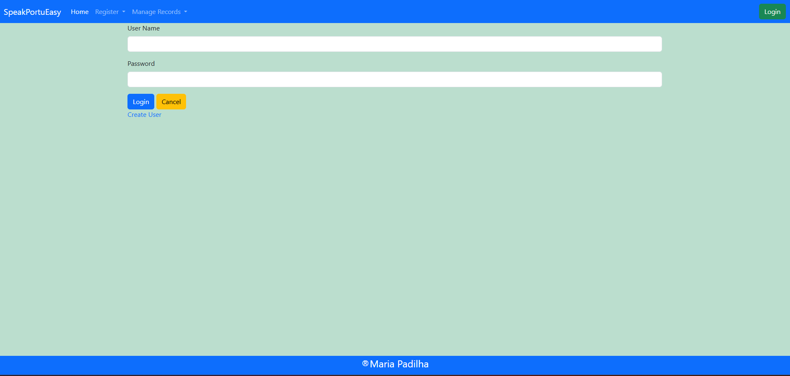
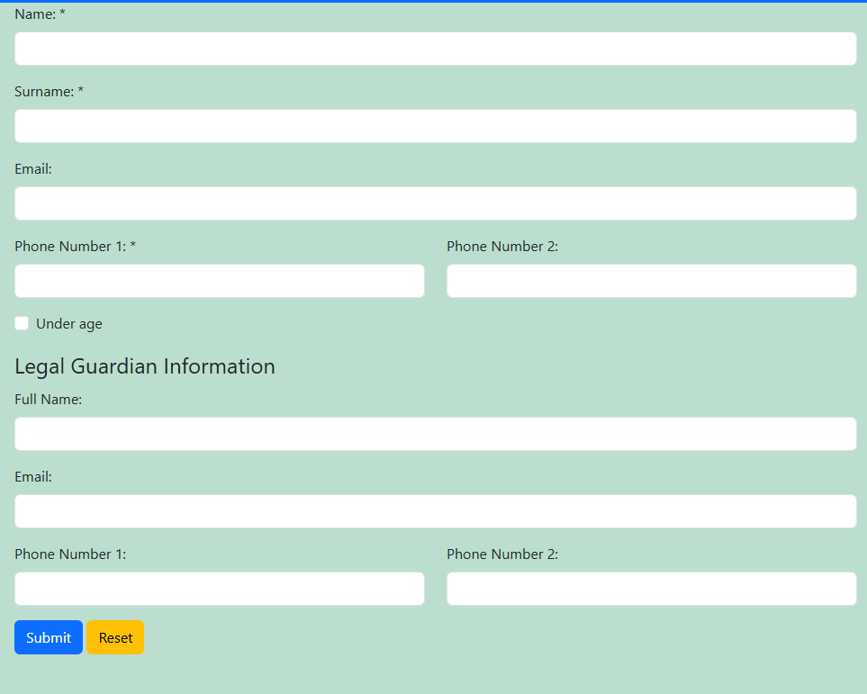
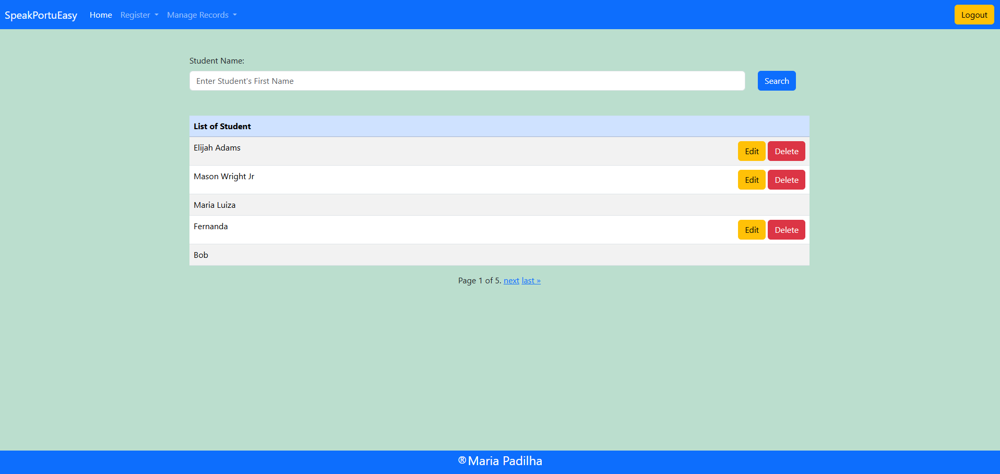
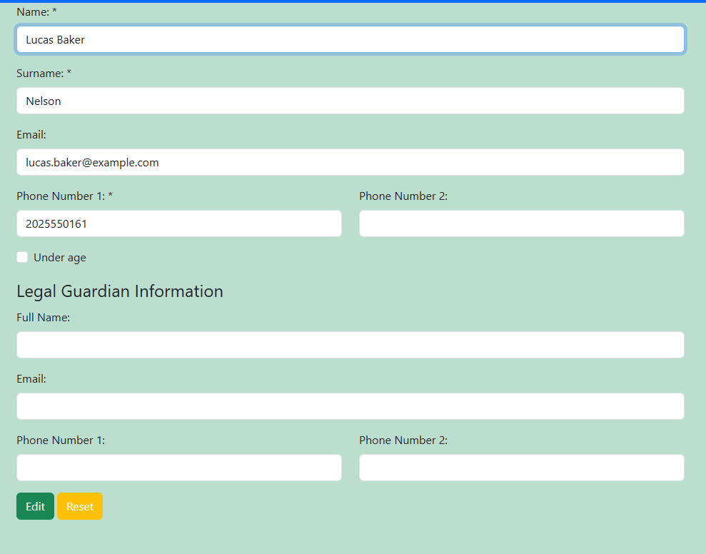
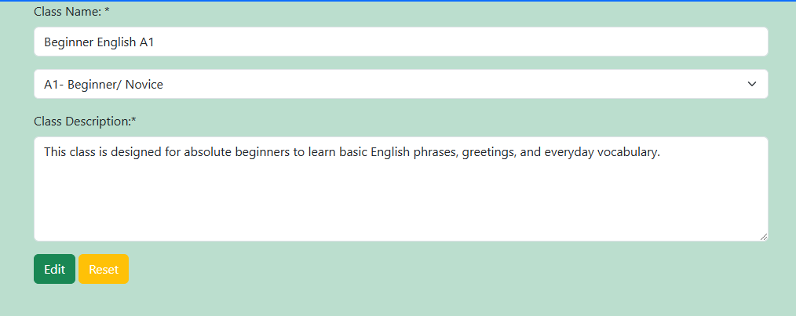
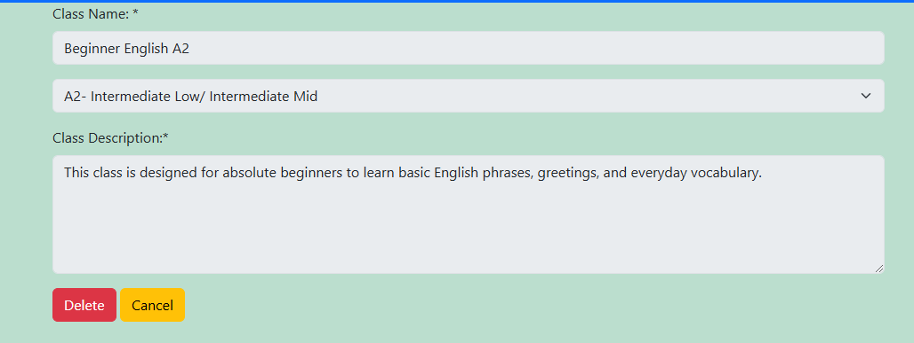
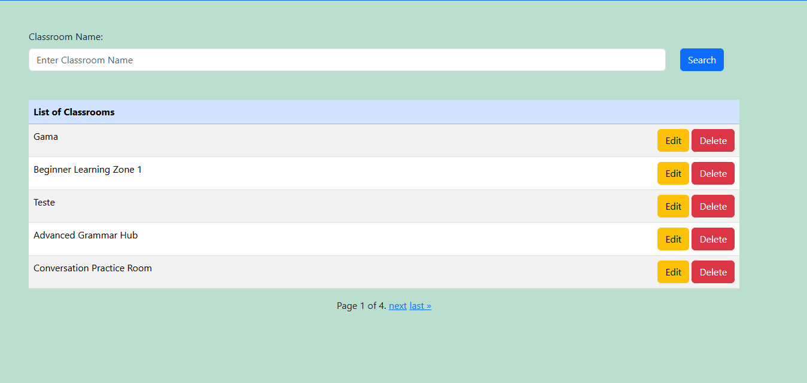
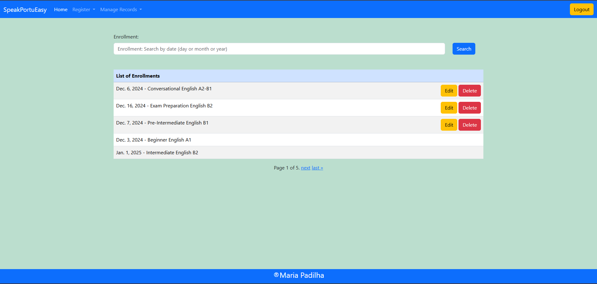
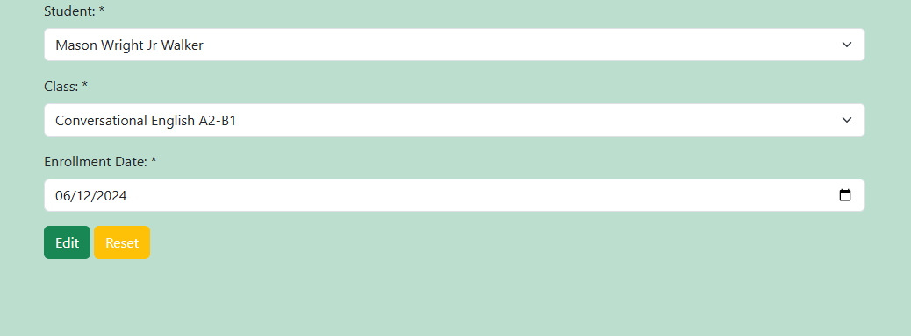
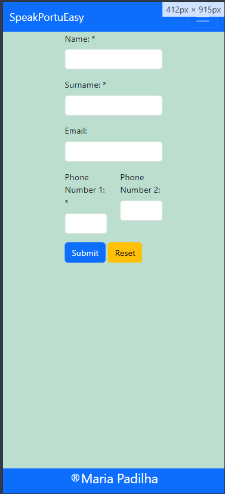

# TESTING

## Table of Contents

- [Device Testing](#device-testing)
- [Browser Compatibility](#browser-compatibility)
- [Manual Testing](#manual-testing-of-user-stories)
- [Automated Testing](#automated-testing)

## Device Testing

### Mobile and Tablet Devices

The application was thoroughly evaluated on various devices to ensure a seamless user experience across different screen sizes:

**Samsung Galaxy S24**

Samsung Galaxy S24

**Iphone 11**

Iphone 11

**Tablet Samsung Galaxy A9**

Iphone 11

## Browser compatibility
To ensure the compatibility and functionality of the system, testing was performed on multiple platforms and browsers. The system was tested on:

- Linux

- Safari Browser

- Samsung Internet Browser 

Since the testing was carried out by external testers on their personal devices, no screenshots were captured during the process. However, the system performed as expected across these platforms and browsers.

- Chrome: 

Main Large screen

Login Large screen

Create User Large screen

Add a new Student Large screen

Search Student Large screen

Edit Student Large screen

Delete Student Large screen

Add a new Class Large screen

Search Class Large screen

Edit Class Large screen

Delete Class Large screen

Add a new Classrooms Large screen

Search Classrooms Large screen

Edit Classrooms Large screen

Delete Classrooms Large screen

Enrollment Large screen

Search Enrollment Large screen

Edit Enrollment Large screen

Delete Enrollment Large screen

Teacher Large screen

Teacher Small screen

Search Teacher Large screen

Edit Teacher Large screen

Delete Teacher Large screen

- AVG Secure Browser 

AVG Secure Browser 

- Fire Fox

Fire fox 

Additionally, during testing on Google Chrome, an intermittent error was observed. Occasionally, users received a warning message stating:

“Dangerous site. Attackers on the site you tried visiting might trick you into installing software or revealing things like your passwords, phone, or credit card numbers. Chrome strongly recommends going back to safety. Learn more about this warning.”

This error did not occur consistently and was not reproducible in incognito mode, suggesting that it may be related to browser settings or cached data. The issue did not affect the core functionality of the system, but it was noted for further investigation.
